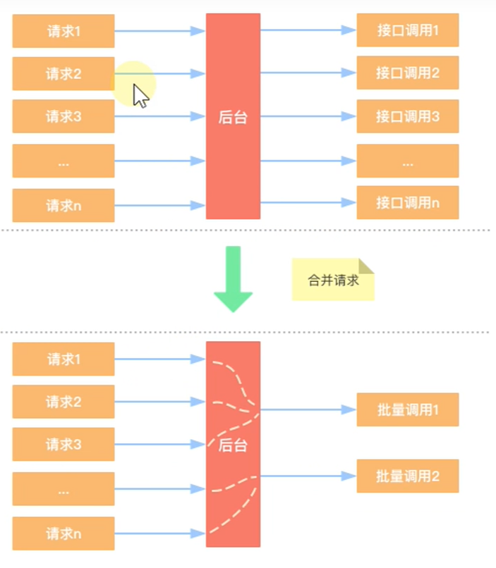
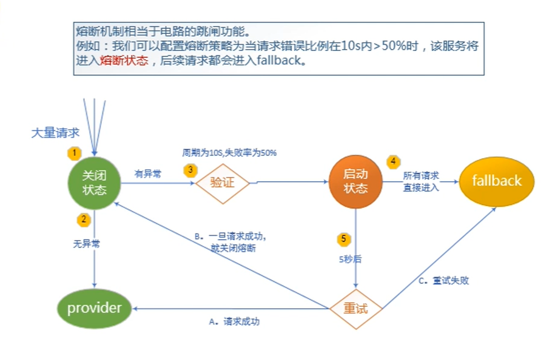

# 服务雪崩
## 定义
&nbsp;&nbsp;&nbsp;&nbsp;&nbsp;&nbsp;&nbsp;
雪崩是系统中的蝴蝶效应导致的，其发生的原因多种多样，从源头我们无法完全杜绝
雪崩的发生。雪崩的根本原因来源于服务之间的强依赖，所以我们提前评估做好服务容错，

## 雪崩的一些场景
* 流量激增：异常流量、用户重试导致系统负载升高
* 缓存刷新：比如A服务调用B服务，当A流量激增，
  导致不停调用B服务，当请求超出了B的承载能力时，就会导致B系统崩溃
* 程序有Bug：
* 硬件故障：
* 线程同步等待：

## 解决方案
* 请求缓存：支持将一个请求与返回结果做缓存处理；
* 请求合并：将多个请求进行合并--一般用在provider里面  
* 服务隔离：将相同的请求进行合并然后调用批处理接口；
* 服务熔断：牺牲局部服务，保全整体系统稳定性的措施；
* 服务降级：服务熔断以后，客户端调用自己本地方法返回缺省值

### 请求缓存
&nbsp;&nbsp;&nbsp;&nbsp;&nbsp;&nbsp;&nbsp;
hystrix为了降低访问服务的频率，支持将一个请求与返回结果做缓存，如果再次
请求的URL没有变化，则直接从缓存中将结果返回，这样可以大大降低访问服务的压力
 
&nbsp;&nbsp;&nbsp;&nbsp;&nbsp;&nbsp;&nbsp;
缓存请使用redis，使用hystrix自带缓存的缺陷如下：
* 本地缓存，集群情况下无法同步
* 不支持第三方缓存容器，如Redis，MemCache
 
可以使用spring来继承redis的方案

### 请求合并
&nbsp;&nbsp;&nbsp;&nbsp;&nbsp;&nbsp;&nbsp;
将多个访问到后台的请求，在后台将其合并，然后进行批量调用，如下图所示：

 
#### 缺点
&nbsp;&nbsp;&nbsp;&nbsp;&nbsp;&nbsp;&nbsp;
设置请求合并之后，本来一个请求5ms，但是现在可能还需要再10ms看看还有没
有其他请求一起，这样一个请求时间就从5ms增加到了15ms

#### 应用场景
&nbsp;&nbsp;&nbsp;&nbsp;&nbsp;&nbsp;&nbsp;
如果我们要发起的命令请求本身就是一个高延迟的命令，那么这个时候就可以使用请求合并了，
因为这个时候消耗就显得微不足道了，另外，高并发也是请求合并的一个重要场景。

### 服务隔离
#### 线程池隔离
&nbsp;&nbsp;&nbsp;&nbsp;&nbsp;&nbsp;&nbsp;
没有线程池隔离的项目所有接口都运行在一个ThreadPool中，当某一个接口压力过大或者
出现故障时，会导致资源消耗殆尽而影响到其他接口的调用而引发服务雪崩效应。
 
&nbsp;&nbsp;&nbsp;&nbsp;&nbsp;&nbsp;&nbsp;
通过每次都开启一个单独的线程运行，它的隔离是通过线程池，即每个隔离粒度都是线程池，
互相不干扰。线程池隔离方式，等于多了一层保护措施，可以通过hystrix直接设置超时，超时
后直接返回。

#### 信号量隔离
 

#### 线程池隔离 VS 信号量隔离
|隔离方式|是否支持超时|是否支持熔断|隔离原理|是否是异步调用|资源消耗|
|----|----|----|----|----|----|
|线程池隔离|支持|支持|每个服务单独用线程池|同步和异步|大|
|信号量隔离|不支持(只能通过socket超时来完成)|通过信号量的计数器|支持|同步|小|

##### 线程池隔离
1. 请求线程和调用provider的线程不一样，由线程池里work线程去调用
2. 支持超时，可直接返回
3. 支持熔断，当线程池达到最大线程数后，再请求会触发fallback接口进行熔断
4. 隔离原理：每个服务单独使用线程池
5. 支持同步和异步
6. 资源消耗大，大量线程上下文切换、排队、调度等，容易造成机器负载高
7. 无法传递Http Header
#### 信号量隔离
1. 请求线程和调用线程是同一个线程
2. 不支持超时
3. 支持熔断，当信号量达到maxConcurrentRequests请求后，再请求会触发fallback接口进行熔断
4. 隔离原理，通过信号量的计数器
5. 同步调用，不支持异步
6. 资源消耗小，只是个计数器
7. 可以传递Http Header

#### 总结
1. 请求并发大，耗时长（计算大，或操作关系型数据库），采用线程隔离策略。这样可以保证大量线程可用，
不会由于服务原因一直处于阻塞或等待状态，快速失败返回。还有就是对依赖服务的网络请求的调用和访问，会
涉及timeout这种问题的都使用线程池隔离
2. 请求并发大，耗时短（计算小，或操作缓存），因为这类服务的返回通常都会非常快，不会占用线程太长时间，
而且减少了线程切换的开销，提高了缓存服务的效率。还有就是适合不是对外部访问的依赖，而是对内部一些比较
复杂的业务逻辑的访问。这种内部的访问，不需要去捕获timeout类似的问题。

### 服务熔断
&nbsp;&nbsp;&nbsp;&nbsp;&nbsp;&nbsp;&nbsp;
服务熔断一般是指软件系统中，由于某些原因使得服务出现过载现象，为防止造成整个系统故障，从而采取的一种
保护措施，所以又叫过载保护。
 
&nbsp;&nbsp;&nbsp;&nbsp;&nbsp;&nbsp;&nbsp;
熔断机制相当于电路的过载保护

### 服务降级
保全核心业务，牺牲一些不相关的服务
#### 触发条件
1. 方法抛出非HystrixBadRequestException
2. 方法调用超时
3. 熔断器开启拦截调用
4. 线程池/队列/信号量跑满
   
   

